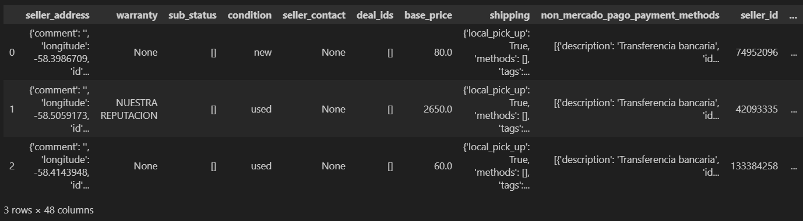
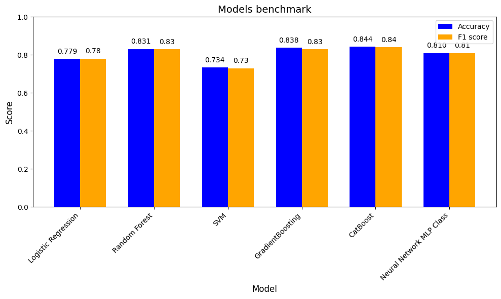
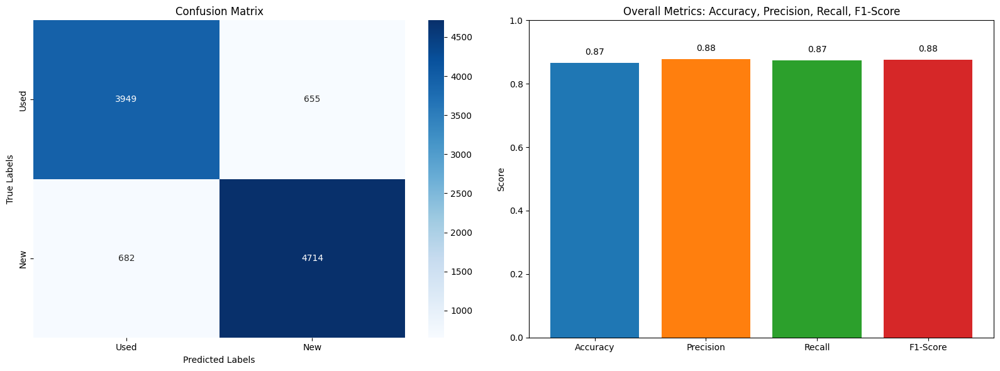
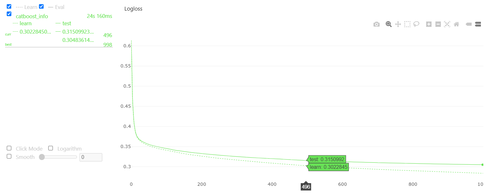
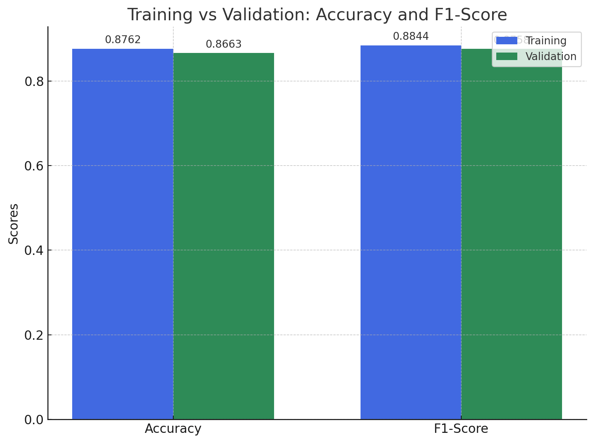
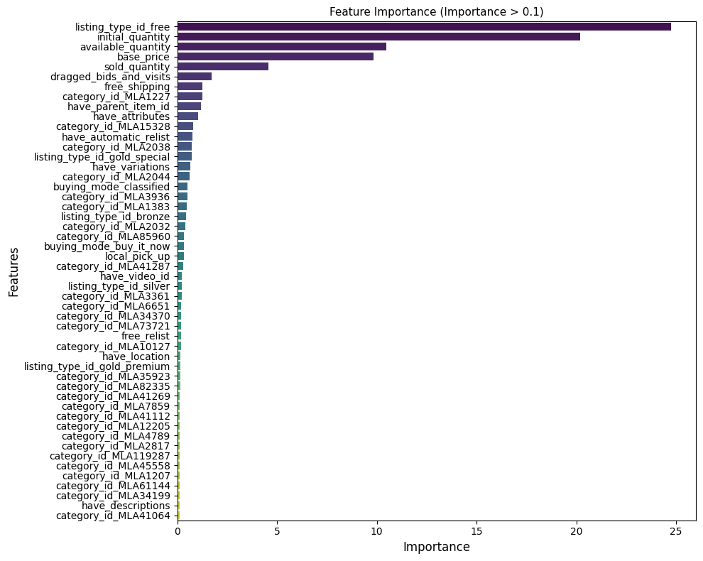

# Modelo para clasificar un articulo como nuevo o usado

Este proyecto se centra en el análisis y modelado de datos provenientes de MercadoLibre para predecir si un artículo listado en el marketplace es nuevo o usado. El objetivo principal es procesar los datos del conjunto MLA_100k.jsonlines, realizar una limpieza y transformación adecuada, y desarrollar un modelo de machine learning capaz de hacer esta predicción con un alto grado de precisión.

A lo largo del proyecto, se utilizarán técnicas de procesamiento de datos como la desnormalización, creación de nuevas características y selección de variables relevantes. Una vez entrenado el modelo, se evaluará su rendimiento utilizando un conjunto de datos de prueba. Además, se garantizará la robustez del modelo mediante tecnicas de evaluacicon sobre el conjunto de entrenamiento y de evaluacion. Este proceso permitirá generar un modelo escalable y eficiente para predecir el estado de los productos en el marketplace, mejorando la experiencia de compra de los usuarios.

## Fuente de datos 
El primer paso es analizar el archivo JSON donde se encuentra almacenada la data,es clave entender las estructuras de datos que contiene para diseñar el proceso de extracción de datos. Este proceso de extraccion de datos se divide en dos fases:

1. **Evaluación y analisis de la primera base de diccionarios autocontenidos:** Es decir, de la primeras estructuras de datos clave:valor dentro del JSON. En esta etapa identificamos los datos que describen el item. Se utiliza la función **json_normalize** para desnormalizar los datos y convertirlos en un DataFrame de pandas



2. **Análisis manual del contenido de las columnas:** El DataFrame de pandas se convierte en un archivo .CSV que se almacena en el directorio raíz. Se utiliza una hoja de cálculo para emplear la interfaz gráfica y explorar los datos de manera rápida y aleatoria. A partir de este proceso, las columnas se clasifican en tres grupos:

* **non-features:** datos despreciados porque tienen alta correlacion con otras columnas, estan vacios o contienen el mismo datos
* **maybe:** datos que pueden ser relevantes pero tiene un nivel de complejidad mayor para su procesamiento.
* **candidate:** datos que van a transformarse para ingresar en una primera iteracion del modelo.

**Nota:**  Los detalles del tratamiento de cada columna se pueden visitar en el notebook: data_preparation.ipynb

## Procesamiento y Selección de Features

1. **Criterios para elegir los features**
En esta primera iteración, para transformar los datos de manera pragmática, se utilizaron inicialmente las columnas numéricas y categóricas como punto de partida. Posteriormente, se transformaron a variables booleanas las columnas que se habían clasificado como candidatas, siguiendo la siguiente premisa: Si la columna proporciona información relevante sobre el ítem, se evalúa si el ítem tiene o no esa información.

Por ejemplo, en la columna have_descriptions, se evalúa si los ítems cuentan con una descripción. Si el ítem tiene una descripción asignada, se asigna el valor 'True'; si no, se asigna 'False'. Esta transformación se realiza en términos numéricos, ya que 'True' se convierte en 1 y 'False' en 0. De esta forma, se generan variables binarizadas que permiten representar la presencia o ausencia de características importantes en los ítems, facilitando su análisis.

El 75% de las variables seleccionadas fueron booleanas, expresadas en 1 y 0.

2. **Procesamiento de variables**

* Tratamiento de variables categoricas
Las variables categóricas se codificaron utilizando One-Hot Encoding. Este es un método que transforma cada categoría en una nueva columna binaria, donde cada valor de la categoría se representa con un 1 en la columna correspondiente y un 0 en las demás. Por ejemplo, si una columna contiene los valores "Nuevo" y "Usado", el One-Hot Encoding creará dos columnas, una para "Nuevo" y otra para "Usado", asignando un 1 o 0 según corresponda a cada ítem

* Tratamiento de variables numericas
Por otro lado, las variables numéricas, como el precio, el número de ítems disponibles y vendidos, fueron escaladas utilizando el Standard Scaler. Este método de escalado transforma los valores numéricos para que tengan una media de 0 y una desviación estándar de 1. Es decir, se resta la media de cada valor y se divide entre la desviación estándar.Esto es importante porque muchos algoritmos de machine learning, como los que usan regularización (la regresión logística, por ejemplo), son sensibles a las magnitudes de las variables. Sin una escala adecuada, variables con rangos mucho más grandes pueden dominar el proceso de aprendizaje llevando a un mal desempeño del modelo.

* Desbalanceo de clases
En el caso del desbalanceo de clases, se observo  que la clase "nuevo" representa un 53.76% de los datos, mientras que la clase "usado" representa un 46.24%. Aunque hay una ligera diferencia entre ambas clases, no es un desbalanceo extremo, pero es algo a tener en cuenta para asegurar que el modelo no favorezca a la clase mayoritaria. Una forma de manejar este desbalanceo es ajustando los hiperparámetros del modelo, específicamente utilizando la técnica de **class_weight**. Este parámetro permite que el modelo asigna un peso mayor a las clases minoritarias durante el proceso de entrenamiento, de manera que los errores cometidos al clasificar la clase menos representada sean penalizados más fuertemente, es decir, el class_weight ajusta la "importancia" que el modelo le da a cada clase. Esto garantiza que el modelo trate ambas clases de manera más equitativa y no ignore la clase menos representada

## Modelado
Una vez se consolido el set de datos para entrenamiento y teniendo en mente el objetivo de clasificación se empezo el proceso de experimentación con desde los modelos mas sencillos hasta lograr el objetivo de un Accuracy minimo de 0.86. 

El proceso de entrenamiento comenzo incluyendo 42 features(Estos pueden consultarse en el notebook data_preparation.ipynb). En orden de selección los modelos usados fueron: 

1. Logistic Regression: Es un modelo sencillo y eficiente para problemas de clasificación binaria. Sirve como una buena línea base.

2. SVM (Support Vector Machine): Ofrece buena precisión para problemas de clasificación, especialmente en datos que no son linealmente separables, aunque fue computacionalmente muy costoso debido a grandes conjuntos de datos.

3. Random Forest: Es un modelo basado en árboles que maneja bien la no linealidad y reduce el riesgo de sobreajuste al promediar múltiples árboles.

4. Gradient Boosting: Mejora la precisión al combinar múltiples árboles secuenciales, ajustando los errores cometidos por los anteriores. Este modelo en un principio parecia ser el ganador, por lo tanto se uso Gridsearch para busqueda de los mejores hiperparametros, luego de 60 minutos de procesamiento logro llegar a 0.83 pero con esto no se conseguia el objetivo.

5. CatBoost: Es una variante optimizada para datos categóricos que ofrece buen rendimiento en este tipo de problemas. Muy adecuado porque si revisamos la mayoria de los datos del modelo son y fueron convertidos a categoricos

6. Neural Network (MLP Classifier): Finalmente, se probó una red neuronal para explorar si una estructura más compleja podía captar patrones más sofisticados en los datos

 A continuacíon se entrega el benchmark con los resultados:



Como es evidente, en este punto de la experimentacion aun no se habia conseguido alcanzar el obejtivo. Entonces se decide incluir la primera columna candidata del grupo maybe: category_id. Esta se codifico usando Onehot Encoding resultando un dataframe de 10948 features. Como punto de partida, se experimento con el modelo que mejor performance tuvo en la primera iteración: **CatBoost**



Con este modelo, se logro el objetivo de un accuracy >= 0.86

## Evaluación del modelo

CatBoost esta basado en Gradient Boosting que está optimizado para manejar variables categóricas de manera eficiente.El algoritmo funciona creando árboles de decisión secuenciales, donde cada nuevo árbol intenta corregir los errores cometidos por los árboles anteriores. Lo que lo diferencia es su manejo avanzado de las categorías y su capacidad para evitar el sobreajuste mediante el uso de un esquema de orden aleatorio, que minimiza el sesgo durante el entrenamiento.

Una vez logrado el desempeño esperado con el Catboost, se realizan validacion para verificar que no este sobreentrenado el modelo. En primer lugar se revisa la funcion de perdida usando el modulo de Catboost para ello. 



Al revisar la función de pérdida se buscaba un equilibrio donde el error en ambos conjuntos (entrenamiento y validación) fuera bajo.Esto asegura que el modelo generalice bien a nuevos datos y no simplemente recuerde los datos de entrenamiento. 

Adicionalmente se evaluaron las metricas en el conunto de entrenamiento y de prueba. Se buscaba que ambas se mantuvieran en los mismo rangos



Tambien es importante revisar para el modelo cuales son los features que tienen mas importancia en la prediccion.

Esto permite explicar de manera más clara a las partes interesadas qué factores están influyendo en las predicciones del modelo.

## Selección de F1 score
Se ha seleccionado **F1 score** como métrica secundaria porque es la **media armónica** entre la precisión (precision) y la exhaustividad (recall), lo que significa que tiene en cuenta tanto los falsos positivos como los falsos negativos. En problemas de clasificación, es crucial no solo predecir correctamente los elementos positivos (como artículos usados), sino también capturar todos los casos posibles sin clasificarlos erróneamente.

Dado que en este caso las clases de artículos nuevos y usados están ligeramente desbalanceadas, el F1-Score ofrece una visión más clara del rendimiento general. Mientras que el accuracy puede verse influenciado por la clase mayoritaria, el F1-Score da más importancia a un equilibrio adecuado en ambas clases, siendo una métrica más robusta en este tipo de situaciones.

## Conclusiones
* **Efectividad del modelo CatBoost para la clasificación:** Tras experimentar con diferentes algoritmos de machine learning, incluyendo Logistic Regression, SVM, RandomForest y otros, se comprobó que CatBoost no solo alcanzó, sino que superó el umbral de rendimiento esperado (accuracy > 0.86) en la tarea de predecir si un artículo es nuevo o usado en MercadoLibre. El modelo demostró un balance robusto entre precisión y exhaustividad, con un F1-Score que indica que el sistema captura correctamente tanto artículos nuevos como usados sin comprometer la precisión. Esto lo convierte en una solución altamente efectiva para el problema de clasificación, especialmente en un entorno donde las características categóricas y no lineales juegan un rol importante.


## Proximos pasos
* Exploración de técnicas NLP para descripciones de productos: Se podría integrar procesamiento de lenguaje natural (NLP) en el modelo para extraer información valiosa de las columnas que contienen descripciones textuales. Aunque en algunos casos las descripciones pueden contener información explícita sobre si el artículo es "nuevo" o "usado", siendo tautologico, esta información podría asignarse un peso específico en el modelo. Un enfoque interesante sería ensamblar un modelo basado en NLP junto con el actual para evaluar su impacto en el rendimiento global y la precisión del sistema.

* Optimización basada en la importancia de características: A partir del análisis de la importancia de las características (feature importance) en el modelo final, se pueden identificar aquellas variables que aportan poco o nada a la predicción. Iterar en la eliminación de estas características irrelevantes no solo simplificará el modelo, sino que también reducirá el riesgo de sobreajuste (overfitting) y mejorará tanto el tiempo de entrenamiento como el de predicción, haciéndolo más eficiente y manejable en un entorno de producción.

## Estructura repositorio

```linux

.
├── readme.md                          # descripcion del repositorio
├── functions.py                       # funciones para procesamiento de datos
├── new_or_used.py                     # orquesta los procesos para correr, evaluar y almacenar el modelo
│
├── notebooks                          # archivos de exploracion de procesos
│   │── data_preparation.ipynb
│   │── models.ipynb
│   └── best_model.ipynb

├── assets                             # carpeta para almacenar recursos de apoyo
│   └── algún-archivo
│
└── requirements.txt                   # requerimientos para correr el repositorio

```